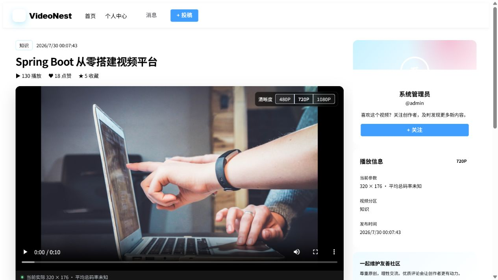
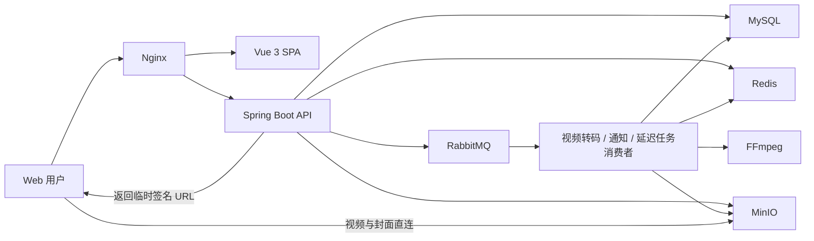
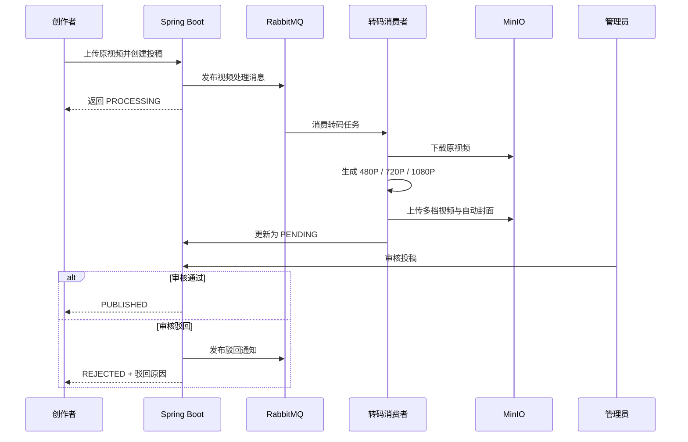
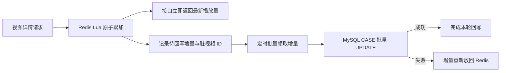

# VideoNest

一个面向学习、作品展示与小规模社区场景的视频社区平台。

VideoNest 采用 Vue 3 与 Spring Boot 前后端分离架构，围绕“投稿、转码、审核、发布、播放、互动、通知、清理”构建完整视频生命周期，并集成 Redis、RabbitMQ、MinIO、FFmpeg、Nginx 与 Docker Compose。

> 项目定位：中小型视频社区原型 / Java 实习与毕业设计项目。重点展示视频业务建模、异步任务、缓存与消息可靠性，而不是简单的 CRUD 页面集合。

## 项目预览

### 视频首页


### 视频播放页



## 核心亮点

| 方向 | 实现 |
| --- | --- |
| 多清晰度转码 | RabbitMQ 异步调度 FFmpeg，生成 480P、720P、1080P 视频并自动截取封面 |
| 视频播放 | 浏览器直接访问 MinIO 临时签名地址，支持清晰度切换、实际分辨率与平均码率展示 |
| 投稿审核 | 视频经历 `PROCESSING → PENDING → PUBLISHED / REJECTED` 状态流转 |
| 社区互动 | 点赞、收藏、评论、二级回复、关注、粉丝列表和站内通知 |
| 热门排行 | 使用 Redis ZSet 综合播放、点赞、收藏和评论行为计算热度 |
| 播放量优化 | Redis 原子累加播放量，定时批量回写 MySQL，避免热门视频单行更新热点 |
| 消息可靠性 | Publisher Confirm、消费重试、死信队列、幂等事件 ID 和人工重投 |
| 资源生命周期 | 逻辑删除、回收站、延迟清理、定时补偿及 MinIO 对象幂等删除 |
| 高并发代理 | Nginx 上游连接池复用，解决持续高 QPS 下临时端口耗尽导致的 502 |
| 一键部署 | Docker Compose 编排前端、后端、MySQL、Redis、RabbitMQ 与 MinIO |

## 功能矩阵

### 用户与认证

- 用户注册、登录和 JWT 身份认证；
- 普通用户、管理员角色权限区分；
- 登录状态恢复和受保护路由跳转；
- 查看个人投稿、点赞、收藏、关注与粉丝列表。

### 视频发现与播放

- 首页推荐流、热门视频、分类筛选和分页；
- 标题关键词搜索；
- 视频详情、作者信息、发布时间、分区和互动统计；
- 480P、720P、1080P 清晰度切换；
- 展示浏览器当前实际播放分辨率和估算平均码率；
- MinIO 临时签名 URL，视频流不经过 Spring Boot 转发；
- 播放、点赞、收藏、评论参与热门榜计分。

### 创作者中心

- 上传封面和原始视频；
- 创建投稿、编辑投稿和删除投稿；
- 查看转码中、转码失败、待审核、已发布和已驳回状态；
- 查看审核驳回原因和转码失败摘要；
- 查看个人视频的播放量、点赞数和收藏数；
- 删除的视频进入回收站保留期，不立即物理删除。

### 视频处理

- 上传完成后通过 RabbitMQ 异步触发视频处理；
- FFmpeg 顺序生成 480P、720P、1080P MP4；
- 使用 H.264、AAC 和 `faststart` 优化浏览器播放；
- 低分辨率源视频不会被强制放大；
- 未上传封面时自动从视频中截帧；
- Redis 分布式锁避免同一视频被重复转码；
- 处理成功后自动进入待审核状态；
- 超时、文件系统错误和 FFmpeg 错误会记录失败原因。

### 互动与关系

- 点赞、取消点赞；
- 收藏、取消收藏；
- 一级评论、二级回复；
- 用户删除自己的评论；
- 评论频率限制；
- 关注、取消关注；
- 查看关注列表和粉丝列表；
- MySQL 唯一索引保证点赞、收藏和关注关系不重复。

### 通知中心

- 点赞、收藏、关注、评论、回复和视频驳回通知；
- 通知分页和未读数量；
- 单条通知标记已读；
- 避免给自己发送无意义互动通知；
- 使用事件 ID 和唯一索引保证通知消费幂等。

### 管理后台

- 查看待审核视频；
- 审核通过或驳回投稿；
- 编辑和删除视频；
- 查看、删除和恢复评论；
- 查看视频回收站并手动永久清理；
- 查看死信记录、错误信息和原始消息；
- 忽略死信或人工重新投递。

## 系统架构



当前采用模块化单体架构：认证、视频、互动、关注、通知、上传等代码按业务模块组织，但运行在一个 Spring Boot 应用中。该结构更适合项目当前规模，部署简单，也保留了后续拆分独立转码 Worker 的空间。

## 核心业务流程

### 投稿与发布



### 播放量写入



该设计将“每次播放都更新 MySQL”改为“Redis 即时计数、MySQL 最终一致”，减少热门视频对同一数据库记录的写竞争。默认每 10 秒处理一批，每批最多 200 个视频。

## 技术栈

| 层级 | 技术 |
| --- | --- |
| 前端 | Vue 3、TypeScript、Vite、Vue Router、Axios、Element Plus |
| 后端 | Java 21、Spring Boot 4、Spring MVC、Spring Security、JWT |
| 数据访问 | MyBatis-Plus、MyBatis XML、HikariCP |
| 数据库 | MySQL 8.4 |
| 缓存 | Redis 7.4、Lettuce、Lua Script、ZSet |
| 消息队列 | RabbitMQ 4.2、Delayed Message Exchange、DLQ |
| 对象存储 | MinIO |
| 视频处理 | FFmpeg、H.264、AAC |
| 网关与静态资源 | Nginx |
| 构建与部署 | Maven、npm、Docker、Docker Compose |

## 消息与任务可靠性

- 业务消息发送使用 RabbitMQ Publisher Confirm 和 Return Callback；
- 转码、通知、审核超时、资源清理分别使用独立队列和死信路由；
- 普通消息消费失败最多重试三次，重试耗尽后进入 DLQ；
- 通知使用事件 ID 唯一索引实现幂等消费；
- 转码使用视频状态和 Redis 锁避免重复执行；
- 审核超时和资源到期清理由延迟交换机触发；
- 资源清理保留定时扫描作为补偿任务；
- 死信记录持久化到 MySQL，支持管理员查看和重新投递；
- 数据库回写播放量失败时，Redis 增量会重新入队，不直接丢弃。

## 视频与资源生命周期

```text
原视频上传
   ↓
PROCESSING（转码中）
   ├─ 失败 → PROCESS_FAILED
   └─ 成功 → PENDING（待审核）
                 ├─ 通过 → PUBLISHED
                 └─ 驳回 → REJECTED

删除视频
   ↓
逻辑删除 / 回收站
   ↓ 保留期到期
删除 MinIO 原视频、三档视频和封面
   ↓
删除点赞、收藏、评论、通知和视频记录
```

MinIO 对象删除按幂等方式处理。对象已经不存在时不会导致整个清理任务失败，清理错误、尝试次数和下次处理时间会保留在数据库中。

## 性能优化与验证

已经完成的性能相关优化：

- Nginx 到后端使用 HTTP/1.1 和 128 条长连接，复用上游 TCP 连接；
- 修复持续高 QPS 下临时端口耗尽导致的 502；
- 播放量由逐请求更新 MySQL 改为 Redis 原子累加和定时批量回写；
- 热门排行使用 Redis ZSet；
- 视频文件存储在 MinIO，播放时由浏览器直连对象存储，避免占用应用服务器带宽；
- 视频转码通过 RabbitMQ 排队，避免 FFmpeg 阻塞 HTTP 请求线程；
- 点赞、收藏、关注和通知依靠唯一索引与幂等逻辑保证一致性。

本机开发环境只读混合压测结果：

| 指标 | 结果 |
| --- | ---: |
| 并发请求数 | 100 |
| 持续时间 | 20 秒 |
| 总请求数 | 58,581 |
| 成功请求 | 58,581 |
| HTTP 502 | 0 |
| 吞吐量 | 约 2,928 QPS |
| P95 | 约 90 ms |
| P99 | 约 135 ms |

> 压测数据来自本机 Docker、小数据量和只读混合接口，仅用于验证优化效果，不能直接等同于生产容量。生产评估应使用接近真实的数据规模、网络环境和至少 10～30 分钟的读写混合压测。

## 项目结构

```text
videonest/
├─ backend/
│  ├─ src/main/java/com/example/demo/
│  │  ├─ common/                 # 统一响应、异常处理
│  │  ├─ config/                 # Security、Redis、MyBatis、日志配置
│  │  ├─ infrastructure/
│  │  │  ├─ mq/                  # 队列、延迟消息、死信与重投
│  │  │  ├─ oss/                 # MinIO 对象存储
│  │  │  └─ redis/               # Redis Key 约定
│  │  ├─ module/
│  │  │  ├─ auth/                # 注册、登录
│  │  │  ├─ video/               # 视频、投稿、审核、转码、清理
│  │  │  ├─ interaction/         # 点赞、收藏、评论
│  │  │  ├─ follow/              # 关注与粉丝
│  │  │  ├─ notification/        # 站内通知
│  │  │  └─ upload/              # 文件上传
│  │  └─ security/               # JWT 认证过滤器
│  ├─ src/main/resources/
│  │  ├─ mapper/                 # MyBatis XML
│  │  └─ application*.yml        # 分环境配置
│  ├─ src/test/                  # 自动化测试
│  ├─ Dockerfile
│  └─ pom.xml
├─ frontend/
│  ├─ src/
│  │  ├─ api/                    # API 调用封装
│  │  ├─ components/             # 公共组件
│  │  ├─ router/                 # 页面路由
│  │  ├─ utils/                  # 前端工具
│  │  └─ views/                  # 主站、创作中心与管理端页面
│  ├─ nginx.conf
│  └─ Dockerfile
├─ deploy/                       # 独立基础设施部署文件
├─ docs/images/                  # README 页面截图
├─ sql/                          # 初始化与增量脚本
├─ docker-compose.yml            # 完整环境编排
├─ .env.example                  # 环境变量模板
└─ README.md
```

## 快速启动

### 环境要求

推荐使用 Docker Compose 一键运行。需要：

- Docker Desktop 或 Docker Engine；
- Docker Compose v2；
- 至少 4 GB 可用内存；
- 首次构建时能够访问 Docker 镜像仓库。

本地源码开发额外需要：

- JDK 21；
- Maven 3.9+；
- Node.js 20+；
- FFmpeg。

### Docker Compose 一键部署

在项目根目录复制环境变量模板：

```powershell
Copy-Item .env.example .env
```

编辑 `.env`，替换数据库、Redis、RabbitMQ、MinIO 和 JWT 示例密钥，然后执行：

```powershell
docker compose up -d --build
```

查看容器状态：

```powershell
docker compose ps
```

停止环境：

```powershell
docker compose down
```

> 请勿把包含真实密码的 `.env` 提交到仓库。`.env.example` 只提供变量名称和示例格式。

### 服务地址

| 服务 | 默认地址 |
| --- | --- |
| VideoNest | `http://127.0.0.1` |
| 后端 API | `http://127.0.0.1:8080` |
| RabbitMQ 管理台 | `http://127.0.0.1:15672` |
| MinIO API | `http://127.0.0.1:9000` |
| MinIO 管理台 | `http://127.0.0.1:9001` |
| MySQL | `127.0.0.1:3306` |
| Redis | `127.0.0.1:6379` |

### 数据库初始化

新环境通过根目录 `docker-compose.yml` 自动执行：

```text
sql/SQL.sql
sql/2026-07-29-enterprise-reliability.sql
```

已有数据库需要根据实际版本手动执行增量脚本。执行前建议先备份数据库。

## 本地源码开发

### 启动基础设施

可以直接启动根目录 Compose 中的基础服务，也可以使用 `deploy/` 下的独立配置：

```powershell
docker compose up -d mysql redis rabbitmq minio minio-init
```

### 启动后端

确认根目录 `.env` 已配置，然后执行：

```powershell
cd backend
mvn spring-boot:run
```

后端默认运行在 `http://127.0.0.1:8080`。

### 启动前端

```powershell
cd frontend
npm install
npm run dev
```

前端开发服务器默认运行在 `http://127.0.0.1:5173`，并将 `/api` 代理到本地后端。

## 构建与测试

```powershell
# 后端自动化测试
cd backend
mvn test

# 后端打包
mvn package

# 前端类型检查与生产构建
cd ../frontend
npm run build

# 完整镜像构建
cd ..
docker compose build
```

当前后端测试覆盖应用上下文、审核驳回通知和通知消费幂等等关键行为。新增业务时建议继续补充 Service 单元测试和真实基础设施集成测试。

## 主要接口

| 模块 | 接口前缀 | 说明 |
| --- | --- | --- |
| 认证 | `/api/auth` | 注册、登录 |
| 分类 | `/api/categories` | 视频分区 |
| 视频 | `/api/videos` | 列表、详情、热门榜 |
| 互动 | `/api/videos/{videoId}` | 点赞、收藏、互动状态 |
| 评论 | `/api/videos/{videoId}/comments` | 评论、回复、删除 |
| 上传 | `/api/files` | 封面与视频上传 |
| 创作者 | `/api/creator` | 投稿、个人视频与数据 |
| 用户关系 | `/api/users` | 关注、取关、粉丝列表 |
| 通知 | `/api/notifications` | 通知列表、未读数、已读 |
| 视频管理 | `/api/admin/videos` | 审核、编辑、删除、回收站 |
| 评论管理 | `/api/admin/comments` | 删除与恢复评论 |
| 死信管理 | `/api/admin/dead-letters` | 查看、忽略、重新投递 |

## 配置说明

主要环境变量参考 `.env.example`：

| 类型 | 变量 |
| --- | --- |
| MySQL | `DB_NAME`、`DB_USERNAME`、`DB_PASSWORD`、`MYSQL_ROOT_PASSWORD` |
| Redis | `REDIS_USERNAME`、`REDIS_PASSWORD` |
| RabbitMQ | `RABBITMQ_USERNAME`、`RABBITMQ_PASSWORD` |
| MinIO | `MINIO_ACCESS_KEY`、`MINIO_SECRET_KEY`、`MINIO_BUCKET` |
| JWT | `JWT_SECRET` |
| 审核与清理 | `VIDEO_REVIEW_TIMEOUT_MILLISECONDS`、`RESOURCE_RETENTION_DAYS` |

播放量批量回写还支持以下后端环境变量。使用 Docker Compose 覆盖默认值时，需要将对应变量加入 `backend.environment`：

| 变量 | 默认值 | 说明 |
| --- | ---: | --- |
| `VIDEO_VIEW_COUNT_FLUSH_DELAY_MILLISECONDS` | `10000` | 回写间隔 |
| `VIDEO_VIEW_COUNT_BATCH_SIZE` | `200` | 每批最大视频数 |
| `VIDEO_VIEW_COUNT_REDIS_TTL_SECONDS` | `604800` | Redis 播放总数过期时间 |

## 简历描述参考

> 基于 Spring Boot、Vue 3、MySQL、Redis、RabbitMQ、MinIO 和 FFmpeg 实现视频社区系统，覆盖投稿、多清晰度转码、审核发布、播放互动、关注与通知等完整业务链路。使用 RabbitMQ 解耦上传与转码，结合重试、死信队列、事件幂等和 Redis 分布式锁保障任务可靠性；使用 Redis 原子计数与定时批量回写优化热门视频播放量写热点，并通过 Nginx 上游连接复用解决持续高并发下临时端口耗尽导致的 502。

建议在简历中只填写自己能够解释并有测试依据的数据。例如：

> 本机 Docker 小数据量环境下，100 并发持续 20 秒完成 58,581 次只读混合请求，错误率 0，吞吐约 2,928 QPS，P95 约 90 ms。

## 已知边界与后续计划

- 当前是单实例模块化单体，不具备服务级高可用；
- 视频转码消费者默认并发为 1，大量投稿时会在 RabbitMQ 中排队；
- 当前压测数据量较小，尚未完成十万级视频和百万级互动数据验证；
- Redis 依赖尚未为全部核心接口提供完整降级策略；
- 标题搜索使用 MySQL 模糊匹配，大规模全文检索可迁移至 Elasticsearch；
- 正式公网播放仍需 CDN、独立对象存储和带宽容量规划；
- 后续可增加 Actuator、Prometheus、Grafana 和链路追踪；
- 后续可将转码消费者拆分为独立 Worker，并按 CPU 核数弹性扩容。

## 安全说明

- 不要提交真实 `.env`、数据库密码、JWT 密钥或对象存储密钥；
- 生产环境必须替换所有示例密码；
- 建议为 MinIO、RabbitMQ 和数据库限制公网访问；
- 正式部署应配置 HTTPS、跨域白名单、请求限流、日志脱敏和定期备份；
- README 中的性能数据是本地验证结果，不代表任意服务器和公网环境下的固定容量。
